<p align="center">
  
  
  
  
</p>

<h1 align="center">NVIDIA CLI v7.0</h1>

<p align="center">
  <strong>An advanced agentic framework for NVIDIA LLMs, featuring persistent memory, skill discovery, and file-based identity (Soul).</strong>
</p>

<br>

<p align="center">
  
</p>

<br>

<p align="center">
  An OpenClaw-inspired multi-agent AI framework for NVIDIA's AI endpoints.<br>
  Build, manage, and orchestrate AI agents with persistent memory, installable skills, and a soul/identity system — all from your terminal.
</p>

<p align="center">
  <a href="#-features">Features</a> &bull;
  <a href="#-quick-start">Quick Start</a> &bull;
  <a href="#-usage">Usage</a> &bull;
  <a href="#-architecture">Architecture</a> &bull;
  <a href="#-roadmap">Roadmap</a> &bull;
  <a href="#-contributing">Contributing</a> &bull;
  <a href="#-license">License</a>
</p>

---

## ✨ Features

### 🤖 Multi-Agent System

Create and manage multiple AI agents, each with their own configuration, model preferences, and behavior. Spawn subagents for parallel task execution.

<p align="center"></p>

```bash
nv agent list              # List all agents
nv agent create mybot      # Create a new agent
nv agent delete mybot      # Remove an agent
```

---

### 👤 Soul / Identity System (OpenClaw)

Give your agents personality through file-based identity documents. The **Soul** acts as active middleware, injecting personality into every interaction.

<p align="center"></p>

| File | Purpose |
|------|---------|
| `SOUL.md` | Core personality principles and values |
| `IDENTITY.md` | Agent name, emoji, and avatar |
| `USER.md` | Human preferences and context |
| `MEMORY.md` | Curated long-term memories |
| `HEARTBEAT.md` | Periodic task definitions |

---

### 🛡️ Skills System & Security Scanning

Discover, install, and manage agent skills. To ensure safety in agentic loops, every skill is scanned for dangerous patterns before installation.

<p align="center"></p>

```bash
nv skill list              # List installed skills
nv skill install <path>    # Install a skill (pip, npm, brew, git)
nv skill uninstall <name>  # Remove a skill
```

> Skills are auto-discovered via `SKILL.md` files and scanned for `eval`, `exec`, and subprocess abuse.

---

### 🧠 Hybrid Memory

Persistent memory with hybrid search combining vector embeddings and keyword (BM25) matching.

- **SQLite-backed** persistent storage
- **Embedding providers:** OpenAI, local (`sentence-transformers`)
- **Automatic context injection** into conversations

```bash
nv memory add "Project uses FastAPI with PostgreSQL"
nv memory search "database setup"
```

---

### 💓 Heartbeat System

Schedule periodic tasks that run within your agent's context — perfect for background maintenance or scheduled data syncing.

<p align="center"></p>

```bash
nv heartbeat status        # Check heartbeat task status
```

- Quiet hours support
- Batch processing for grouped checks

---

## 🚀 Quick Start

### Installation

```bash
# Clone and enter the repository
git clone https://github.com/SingularityAI-Dev/Nvidia-CLI.git
cd Nvidia-CLI

# Set up the environment
python3 -m venv .venv
source .venv/bin/activate
pip install -e .
```

### Set Up Your API Key

```bash
export NVIDIA_API_KEY="nvapi-your-key-here"
# Or simply run 'nv chat' to be prompted
```

---

## 📖 Usage

### Interactive Chat & Initialisation

Use the `/init` command to have the agent analyze your current codebase and generate a context map.

<p align="center"></p>

```bash
$ nv chat
nv> /init
[*] Analyzing codebase...
[*] Context saved to .nv/NVIDIA.md
```

### In-Chat Slash Commands

| Command | Description |
|---------|-------------|
| `/init` | Analyze codebase and generate context file |
| `/add <file>` | Load a file into conversation context |
| `/clear` | Reset conversation and file context |
| `/model <name>` | Switch AI model mid-session |
| `/skill` | Manage skills within chat |
| `/help` | Show available commands |
| `/quit` | Exit with session summary |

### Permission Modes

Control how the agent interacts with your system:

| Mode | Behavior |
|------|----------|
| `ask` | Always ask before any action *(default)* |
| `accept_edits` | Auto-accept file edits, ask for other actions |
| `auto` | Auto-approve safe operations |
| `never` | Dry-run mode — no actions executed |

---

## 🏗️ Architecture

<p align="center">
  
</p>

```
nv_cli/
├── agents/          # ReActAgent loop & subagent orchestration
├── config/          # Configuration & validation
├── heartbeat/       # Task manager & scheduler
├── memory/          # Hybrid search (vector + BM25)
├── skills/          # Multi-installer & security scanner
├── soul/            # Identity loading (OpenClaw style)
├── tools/           # Built-in tool implementations
└── utils/           # Shared utilities
```

---

## 🗺️ Roadmap

- [ ] Plugin marketplace for community skills
- [ ] Multi-agent collaboration workflows
- [ ] Web UI dashboard
- [ ] Voice input/output support
- [ ] RAG pipeline integration

---

## 🤝 Contributing

Contributions are welcome! Please open an [issue](https://github.com/SingularityAI-Dev/Nvidia-CLI/issues) or submit a pull request.

---

## 📄 License

MIT License. See [LICENSE](LICENSE) for details.

---

<p align="center">
  Built with ❤️ and NVIDIA AI &bull;
  <a href="https://github.com/SingularityAI-Dev/Nvidia-CLI">GitHub</a> &bull;
  <a href="https://github.com/SingularityAI-Dev/Nvidia-CLI/issues">Issues</a>
</p>
